# MyWave

# 📖 О программе
Приложение для книголюбов, позволяющее просматривать библиотеку, отслеживать новинки, добавлять книги и цитаты в избранное. Удобный поиск по жанрам, названию и авторам. Отслеживайте прогресс чтения и наслаждайтесь комфортным чтением с настройками шрифта, интервалов между строками и авто-скроллом с подсветкой активной строки.

## 👨‍💻 iOS Deployment Target: 17.6

## 💻 Технический стек
- Swift
- SwiftUI

## 📚 Чтение и взаимодействие
- Система отслеживания прогресса чтения
- Добавление книг и цитат в избранное
- Гибкие настройки шрифта и интервалов между строками
- Автоматическое выделение и скролл до активной строки

## 🔍 Поиск и каталог
- Удобный поиск книг по названию, жанрам и авторам
- Просмотр библиотеки и отслеживание новинок

## 📱 Скриншоты

<h3 align="center">Authorization Screen</h3>

    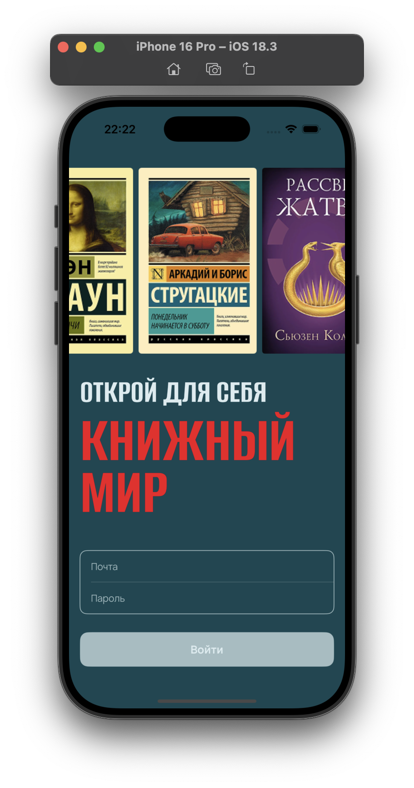
    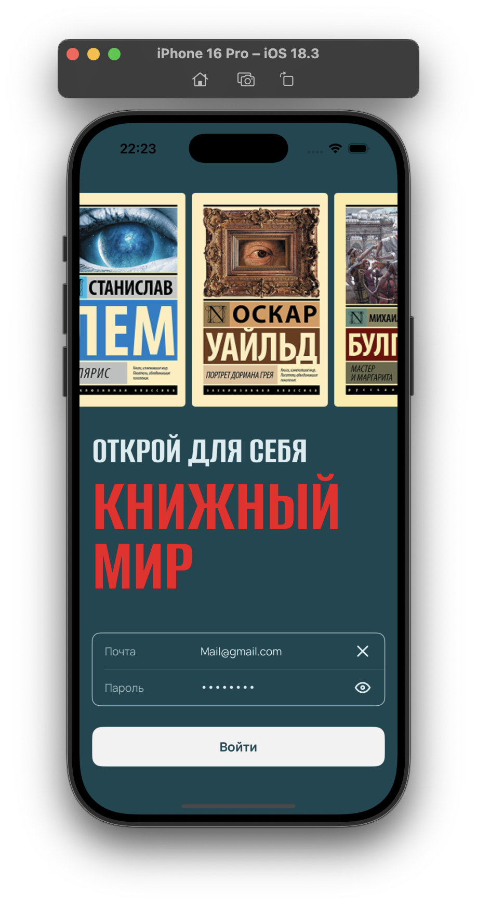
    

<h3 align="center">Library Screen</h3>

    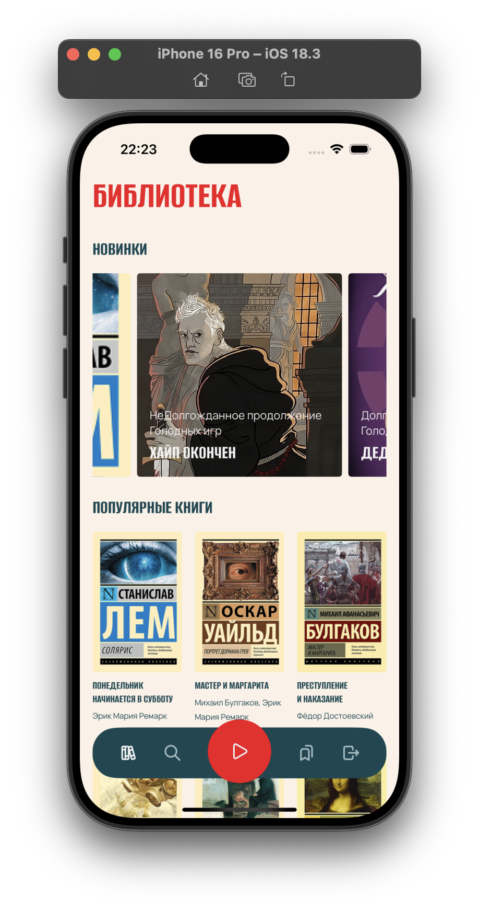
    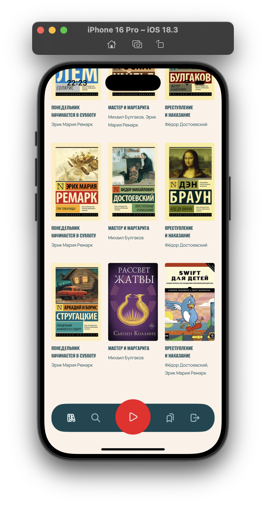

<h3 align="center">Search Screen</h3>

    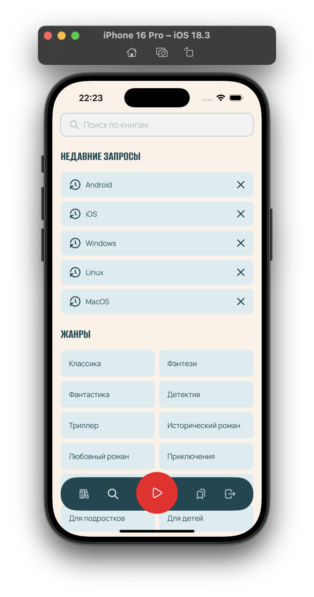
    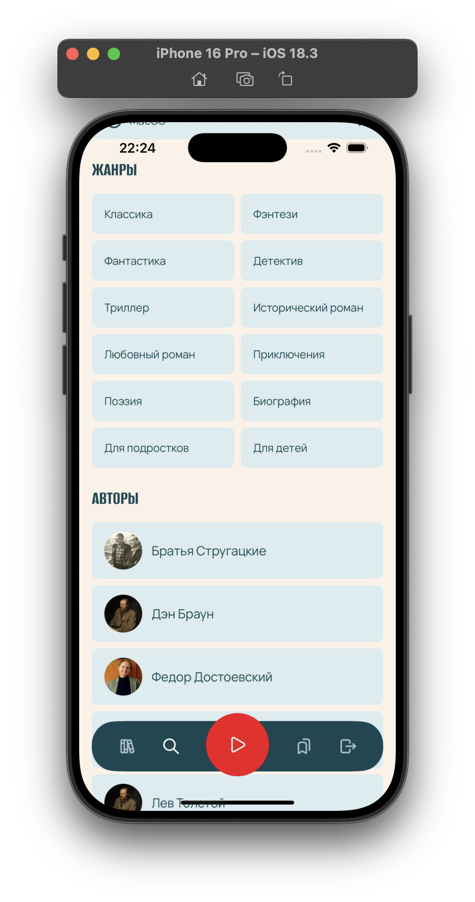

    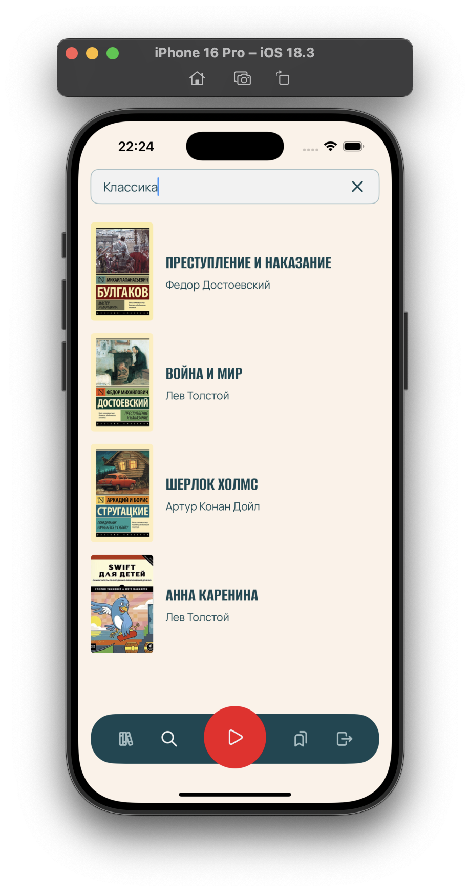

<h3 align="center">Bookmarks Screen</h3>

    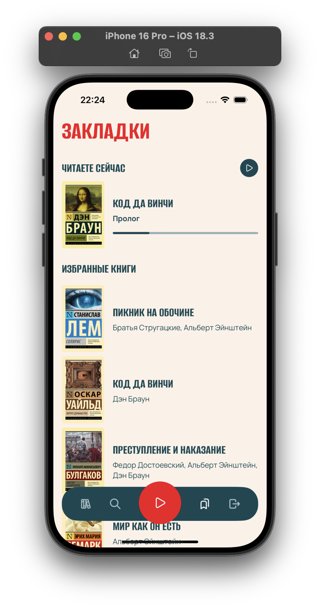
    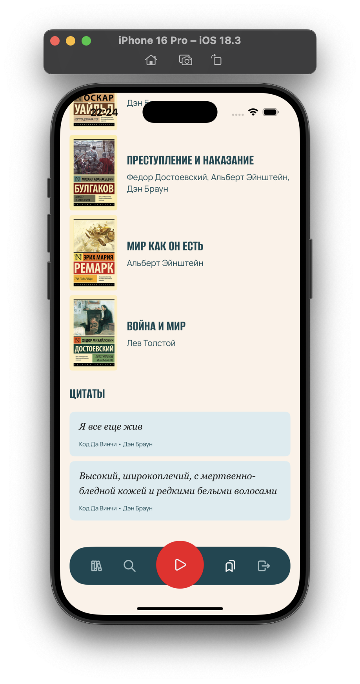

<h3 align="center">Chapter Screen</h3>

    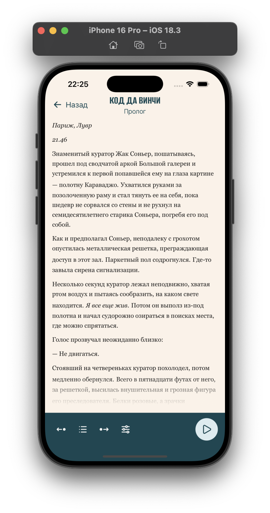
    

    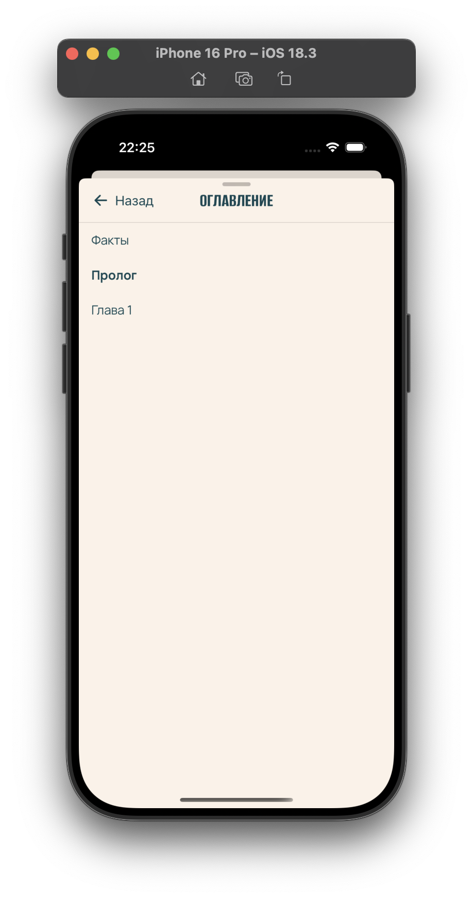
    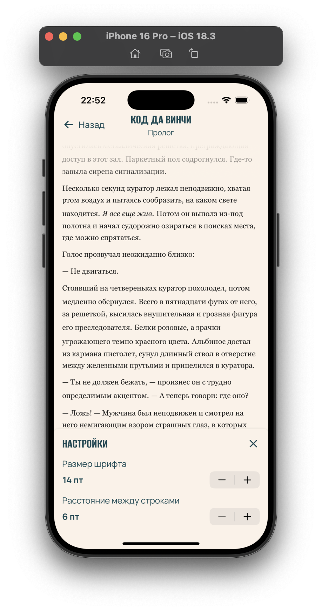

<h3 align="center">Movie Details Screen</h3>

    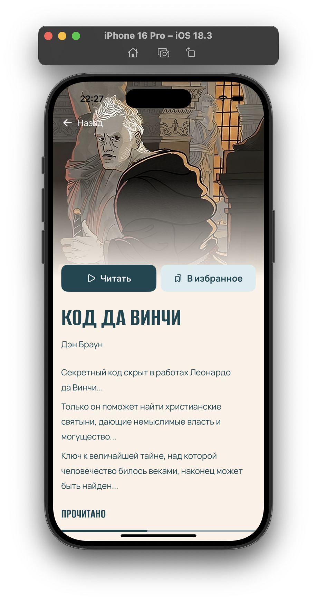
    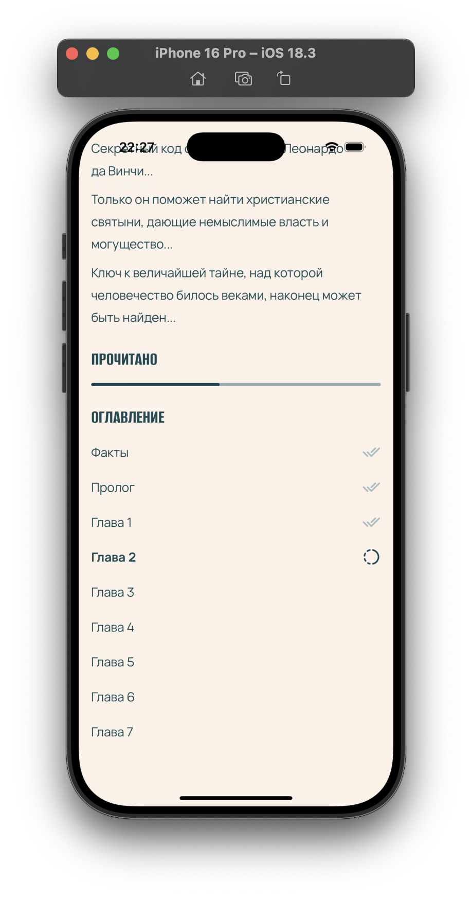

